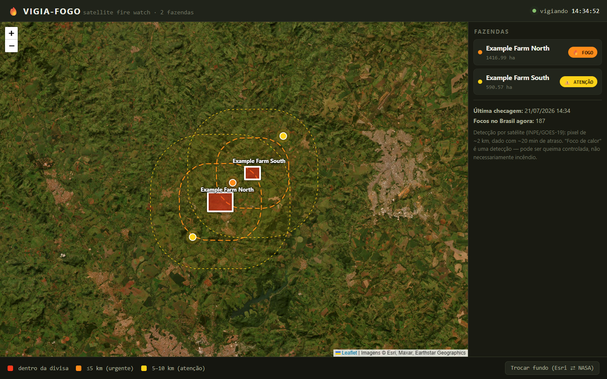

# 🔥 Wildfire Watch (vigia-fogo)

**Um robô de vigilância de queimadas por satélite para fazendas de família — feito
para rodar de graça, e feito para admitir quando está cego.**

A cada 10 minutos ele baixa os focos de calor detectados por satélite sobre o
Brasil inteiro, confere se algum caiu dentro (ou perto) de uma fazenda cadastrada,
e manda e-mail para quem pode realmente fazer alguma coisa a respeito.

Versão em inglês: **[README.md](README.md)** · Construído para uso real em fazendas
de família em Minas Gerais. Este repositório traz fazendas de exemplo; as divisas
reais ficam num repositório privado.



---

## O problema

Fogo em pasto seco anda a 3–4 km/h. Quase sempre começa na terra de outro — beira
de estrada, queima do vizinho que escapou — e chega na sua cerca antes de alguém na
sede ver fumaça. De madrugada, ninguém vê nada.

Existem plataformas comerciais de detecção de incêndio, e elas cobram por isso. Só
que todo o dado que revendem é público: o INPE publica os focos de calor do país
inteiro a cada 10 minutos, de graça.

Ou seja, o problema interessante não é detectar. É tudo em volta.

## O que ele faz de fato

- **Vigia** — baixa os focos do INPE e testa cada um contra a divisa da fazenda
  mais dois anéis (5 km = urgente, 10 km = chegando).
- **Agrupa** — focos a até 2 km um do outro são um incêndio só, não cinco e-mails.
- **Escala** — fogo que se aproxima fura o silêncio de 60 minutos. Fogo vindo na
  sua direção nunca é calado.
- **Alerta** — e-mail com distância, rumo, link do mapa, **para quem ligar**,
  **onde tem água** e um aviso fixo de segurança.
- **Presta contas** — resumo diário "estou vivo" e alarme alto quando fica cego.
- **Mostra** — painel local no navegador sobre imagem real de satélite.

## A decisão de projeto que eu defenderia numa entrevista

**Um sistema de monitoramento que falha em silêncio é pior que nenhum sistema.**

A primeira versão tinha um defeito que nenhum teste pegava e nenhum usuário
perceberia. Quando o servidor do INPE caía, o robô registrava um aviso — numa
janela de console que não existe, porque ele roda invisível — e seguia em frente.
Às 18h o resumo diário dizia, do mesmo jeito:

> ✅ Robô de pé. Vigiei suas 5 fazendas. Nenhum alerta de fogo — **tudo em ordem**.

Isso podia ser mentira. O contador por trás dessa frase era zero tanto quando não
houve fogo quanto quando ninguém *olhou*. Numa noite de temporada de queimadas,
essa é a pior saída possível: falso conforto.

O conserto reorganiza o sistema inteiro em torno de uma distinção — **"rodando"
não é "enxergando"**:

- todo ciclo devolve `ok` ou `cego`, inclusive no caso traiçoeiro do servidor que
  responde mas parou de publicar (guarda de dado velho, limite de 60 minutos —
  o atraso real medido é de ~6 minutos, ou seja 10x de folga);
- ciclo que estoura também conta como cegueira, não como "tudo bem";
- seis ciclos cegos seguidos (~1 hora) disparam um e-mail de emergência dizendo
  com todas as letras que as fazendas **não estão sendo vigiadas agora**;
- o resumo diário não consegue mais dizer "tudo em ordem" sem ter olhado. Ele tem
  três formatos — limpo / cego em parte / cego o dia todo — e **o assunto muda
  junto**, porque o assunto é o que se lê no celular.

## Outras decisões que vale nomear

| Decisão | Escolha | Motivo |
|---|---|---|
| Método de detecção | Geometria simples, **sem IA** | Teste de ponto dentro de retângulo resolve. IA acrescentaria custo, latência e imprevisibilidade a um sistema cuja única moeda é confiança. |
| Volume de alerta | Meta dura: **1–2 e-mails/dia** na seca | São ~1.000 km² vigiados contra ~27 km² de fazenda. Se afogar a caixa de entrada em agosto, o dono para de ler — e aí o sistema falha por completo enquanto aparenta funcionar. |
| Endereços de terceiros | Variáveis de ambiente | O INPE pode mudar o endereço quando quiser. O que um terceiro controla não pode estar cravado no código. |
| Configuração faltando | **Cobrada, nunca omitida** | Alerta sem telefone imprime "sem telefone cadastrado — preencha". Buraco silencioso é pior que buraco visível. |
| Dependências | **Zero** (só biblioteca padrão do Python) | Nada para instalar, nada para quebrar em atualização, nada para pagar. O Leaflet vem embutido, então o painel funciona offline. |
| Alerta urgente | Carrega aviso de segurança | Um e-mail que diz "corra" pode mandar alguém sozinho, de moto, contra uma frente de fogo com vento. Quem manda correr deve as instruções de não morrer. |

## Como funciona

```
CSV do INPE      ──►  leitura ──►  teste geométrico   ──►  agrupa ≤2 km ──►  silêncio +
(Brasil inteiro)                   (divisa + anéis)        (1 fogo =         escalada
                                                            1 alerta)            │
                                                                                 ▼
   painel-estado.json  ◄── painel (Leaflet + imagem Esri)          e-mail (SMTP)
   estado-vigia.json   ◄── contadores de saúde, silêncio por fazenda
```

Tudo num processo só, com laço de 10 minutos, trava do sistema operacional para
duas cópias não brigarem, e gravação atômica de estado para queda de energia não
deixar arquivo pela metade.

## Como rodar

Sem `pip install` — Python 3.10+ e mais nada.

```bash
cp .env.example .env                    # preencha as credenciais de e-mail
python -X utf8 vigia.py --teste-email   # confirma que o e-mail chega
python -X utf8 vigia.py --uma-vez       # roda 1 ciclo e sai
python -X utf8 vigia.py                 # fica vigiando
python painel.py                        # painel em 127.0.0.1:8000
```

Cadastrar fazenda pelo número do CAR (Cadastro Ambiental Rural) ou por um arquivo
KMZ/KML exportado do Google Earth:

```bash
python -X utf8 tools/cadastrar_fazenda.py --car "UF-9999999-XXXX...." --nome "Talhão Norte"
python -X utf8 tools/cadastrar_fazenda.py --kmz divisa.kmz --nome "Talhão Norte"
```

O caminho do KMZ recusa cadastrar fazenda a mais de 150 km das outras sem
confirmação explícita — é a checagem que pega latitude trocada com longitude, erro
que não produz mensagem nenhuma, só um vigia guardando a terra de um estranho.

## Simulado — testar a corrente inteira com fogo real

Saber que o robô está rodando **não é** saber que o alerta chega em quem precisa
agir. O simulado prova a corrente toda — baixar, detectar, agrupar, montar, enviar,
chegar — usando um incêndio de verdade queimando agora em algum lugar do Brasil.

```bash
python -X utf8 tools/simulado.py                  # acha fogo ativo e manda o alerta
python -X utf8 tools/simulado.py --sem-email      # mostra o que sairia, não envia
python -X utf8 tools/simulado.py --perto-de -16.75,-47.93 --raio-km 100
```

O e-mail chega marcado **🧪 SIMULADO** no assunto e na primeira linha, pra ninguém
agir achando que é fogo na própria terra.

**Ele não mexe em nada:** não altera config, não altera estado (ponteiro, silêncio
de 60 min, contador do resumo) e não briga com o vigia rodando. Nada pra limpar
depois — de propósito. A alternativa óbvia, cadastrar uma "fazenda de teste",
funciona igual e acrescenta um risco que não compensa: esquecer de remover, e em
agosto o alerta diário treina o dono a ignorar a caixa de entrada.

Quando o `--perto-de` não acha nada, o script diz com todas as letras que isso é
**ausência de fogo, não falha do robô**. Teste que pode falhar por dois motivos
diferentes não prova nada.

⚠️ O e-mail é a parte fácil. **Cronometre a outra:** do alerta chegar até alguém
estar no local com equipamento. Se a resposta for "não sei", o sistema não está
pronto, por melhor que o código esteja.

## Testes

```bash
python -m unittest discover -s tests -v    # 117 testes
```

Funções puras testadas direto; o ciclo testado com dublês injetados para rede,
e-mail e disco. Os testes que mais importam são os que exigem que o sistema **se
recuse a dizer que está tudo bem** — por exemplo
`test_sem_nenhum_ciclo_bom_nunca_diz_que_esta_tudo_certo`.

## Limites honestos

- **Os primeiros 30 a 60 minutos são invisíveis.** O satélite GOES-19 tem pixel de
  ~2 km: enxerga fogo que já tomou corpo, não fogo que acabou de começar. Do
  fósforo ao e-mail são de 30 minutos a 1h40. Isto é um vigia noturno com
  binóculo, não um detector de fumaça.
- **Fogo debaixo de mata é mal enxergado** — justamente onde fica a vegetação
  nativa protegida por lei.
- **Nuvem espessa bloqueia** o infravermelho que o satélite mede.
- **É a segunda camada.** Aceiro, equipamento e vizinhos são a primeira. Sistema
  de alerta que faz as pessoas afrouxarem a guarda aumentou o risco, não diminuiu.

## Licença

MIT — ver [LICENSE](LICENSE).
